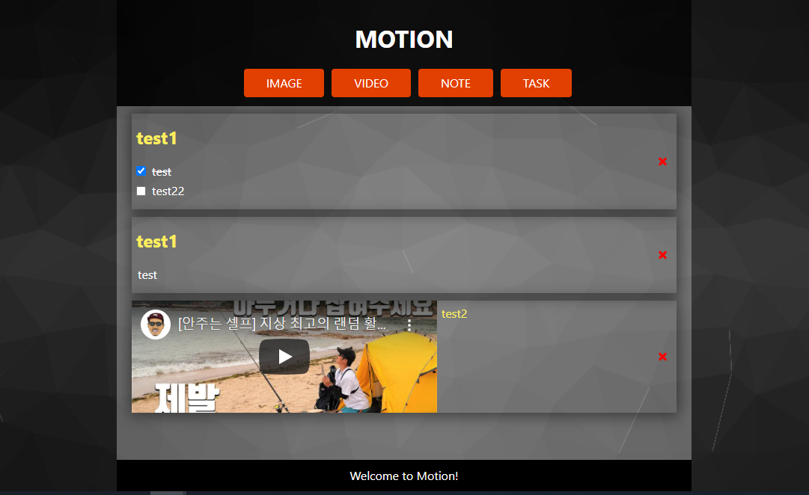

# Motion

## Languages and Frameworks Used:

- [Typescript](https://www.typescriptlang.org/)
- [React.js](https://reactjs.org/)
- [Redux.js](https://redux.js.org/)

---

## What is this?

todo 리스트를 여러 형태로 적을 수 있는 웹어플리케이션입니다.

---

### 실제 서비스 주소

- https://quizzical-sammet-523030.netlify.app/

---

### 주요기능

1.  여러 형태의 Todo 작성 가능
2.  각 Todo 삭제 및 저장 가능

### 사이트 화면 이미지

 - 메인 페이지
